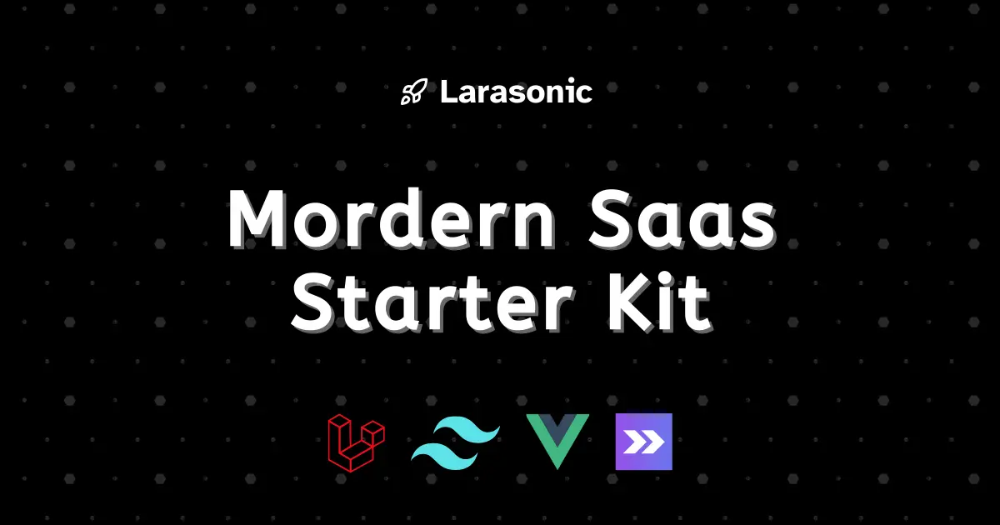

# Larasonic 🚀



Larasonic is a modern, open-source AI chat platform built with Laravel, Vue.js, and Inertia. It provides a powerful foundation for building AI-powered chat applications with features like team collaboration, multiple AI models support, and real-time communication.

[](https://github.com/pushpak1300/Larasonic/stargazers)
[](https://opensource.org/licenses/MIT)

## ✨ Features

- ⚡ 10x Dev Experience
- 🐳 Production Docker Ready
- 🔑 Advanced Authentication
- 💳 Payment Ready
- 🌐 API Ready
- 🎨 Customizable UI
- 🧠 AI Integration Ready
- 📊 FilamentPHP Admin
- ✨ Evolving Features

## Quick Start

```bash
# Clone the repo
git clone git@github.com:pushpak1300/Larasonic.git
cd Larasonic

# Install dependencies
docker run --rm \
    -u "$(id -u):$(id -g)" \
    -v "$(pwd):/var/www/html" \
    -w /var/www/html \
    laravelsail/php83-composer:latest \
    composer install --ignore-platform-reqs

# Setup environment
cp .env.example .env
./vendor/bin/sail up -d
./vendor/bin/sail composer run setup
```

For detailed installation instructions and documentation, visit [docs.larasonic.com](https://docs.larasonic.com).

## Hosting

Proudly hosted and sponsored by [Sevalla.com](https://sevalla.com/?ref=larasonic).

## Security

Report vulnerabilities to pushpak1300@gmail.com

## License

[MIT](https://opensource.org/licenses/MIT)

## Screenshots

|   |  |  |
|:-------------------------------------------------------------------------------------------------:|:-------------------------------------------------------------------------------------------------:|:-------------------------------------------------------------------------------------------------:|
|  |  |  |

